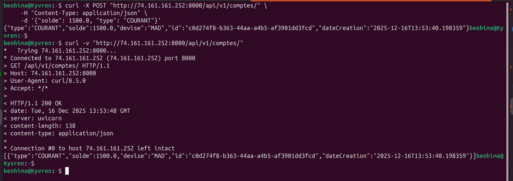
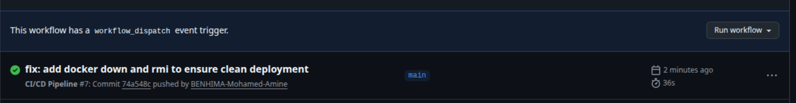
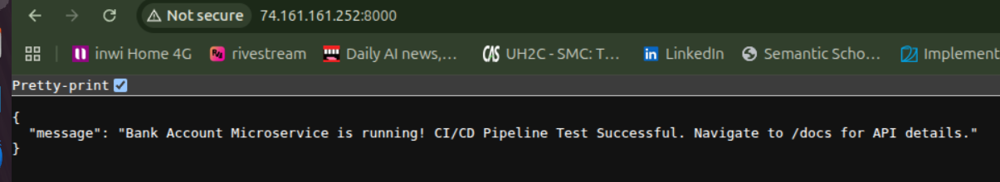
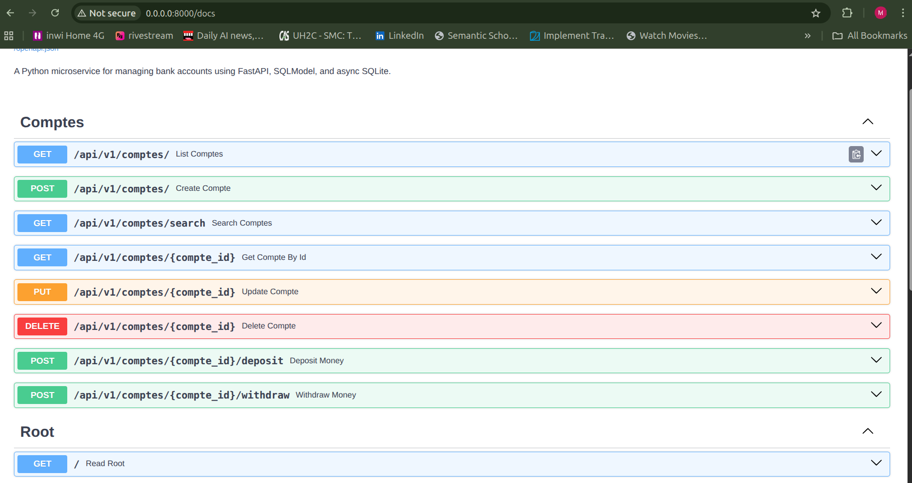
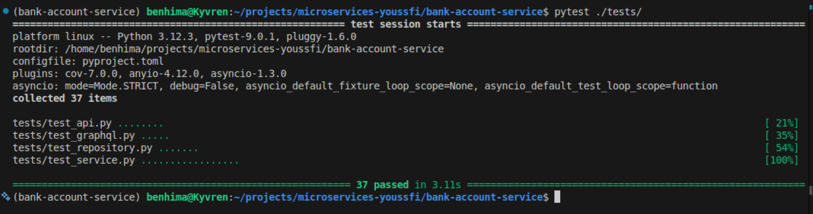

# **Bank Account Microservice 🏦**

A high-performance, asynchronous microservice for managing bank accounts. Built with **Python 3.12** and **FastAPI**.

## **🚀 Project Overview**

* **Goal:** Robust backend engine for banking operations.  
* **Capabilities:** Account creation, balance management, advanced searching.  
* **Design:** Cloud-ready, containerized, and fully testable.  
* **Architecture:** Follows Clean Architecture principles.

### **🛠 Technology Stack**

* **Language:** Python 3.12+ (Modern Typing features)  
* **Framework:** FastAPI (Asynchronous Web Framework)  
* **ORM:** SQLModel (SQLAlchemy \+ Pydantic)  
* **Database:** SQLite (Async via aiosqlite for Dev/Test)  
* **Testing:** Pytest, Pytest-Asyncio, Httpx  
* **Dependency Manager:** uv (Fast Python package installer)  
* **Containerization:** Docker & Docker Compose  
* **Cloud Platform:** Microsoft Azure (Ubuntu Virtual Machine)

## **🏗 Architecture & Design Pattern**

The project uses a **Layered Architecture** to ensure separation of concerns.

### **1\. The Layers**

* **📂 Routers (/api):** Handles HTTP requests/responses. No business logic.  
* **⚙️ Services (/services):** Enforces business rules (e.g., overdraft protection).  
* **💾 Repositories (/repositories):** Abstracts database access and raw queries.  
* **📦 Models (/models):** Defines database schema and domain entities.

### **2\. Project Structure**

bank-account-service/  
├── src/  
│   ├── api/             \# API Routes  
│   ├── core/            \# Config & Database Setup  
│   ├── models/          \# Database Tables & Pydantic Schemas  
│   ├── repositories/    \# CRUD Operations  
│   └── services/        \# Business Logic  
├── tests/               \# Test Suite  
├── docker-compose.yml   \# Container Orchestration  
├── Dockerfile           \# Multi-stage Build  
├── pyproject.toml       \# Dependencies  
└── README.md

## **✅ Features & Endpoints**

| Method | Endpoint | Function |
| :---- | :---- | :---- |
| POST | /api/v1/comptes/ | Create a new Account |
| GET | /api/v1/comptes/ | List Accounts (Supports Projections) |
| GET | /api/v1/comptes/search | Search by Type or Balance Range |
| POST | /api/v1/comptes/{id}/deposit | Credit Account |
| POST | /api/v1/comptes/{id}/withdraw | Debit Account (Safe) |

## **☁️ Cloud Deployment (Azure)**

The application is deployed on a Microsoft Azure Virtual Machine.

### **Deployment Process (Manual)**

1. **Infrastructure:** Created Azure Resource Group & Ubuntu VM (Standard\_B1s).  
2. **Networking:** Configured NSG (Firewall) to allow:  
   * **Port 22:** SSH Access.  
   * **Port 8000:** FastAPI Application.  
3. **Environment:** Installed Docker Engine & Docker Compose on the VM.  
4. **Deployment:** Cloned repository and executed docker-compose up \-d.

### **Verification**

* **Status:** Application is accessible via the Public Azure IP.  
* **Proof:** Terminal verification showing response from the remote server.



## **🔄 CI/CD Automation (GitHub Actions)**

Fully automated pipeline that handles testing and deployment to Azure VM.

### **Pipeline Workflow**

**Trigger:** Automatic on every push to `main` branch.

**Stage 1: Continuous Integration (Quality Gate)**

* **Environment:** Ubuntu Latest, Python 3.12.
* **Dependency Management:** Uses `uv` for fast installation from `uv.lock`.
* **Action:** Runs full pytest suite (32 tests).
* **Rule:** If any test fails, deployment is blocked.

**Stage 2: Continuous Deployment (Zero-Downtime)**

* **Access:** Authenticates via SSH using GitHub Secrets.
* **Strategy:** Git Pull Deployment:
  * Navigates to project folder on Azure VM.
  * Pulls latest code (`git pull origin main`).
  * Stops old containers and removes images (`docker compose down --rmi local`).
  * Rebuilds and starts new containers (`docker compose up -d --build`).

### **Pipeline Validation**

Successful execution of the CI/CD pipeline:



Automatic deployment verification (updated welcome message):



## **📸 Documentation & Validation**

### **1\. Interactive API Documentation**

Auto-generated Swagger UI accessible via the deployed URL.



### **2\. Testing Suite**

Rigorous testing environment covering all business logic.

* **Framework:** Pytest  
* **Result:** 100% Pass Rate (32/32 Tests).



## **⚡ How to Run Locally**

### **Using Docker (Recommended)**

Ensures a consistent environment.

```bash
# 1. Build and Start
docker-compose up --build -d

# 2. Access API
# Open http://localhost:8000/docs
```  
 

